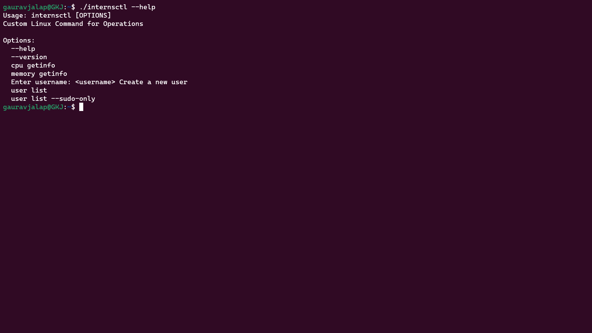
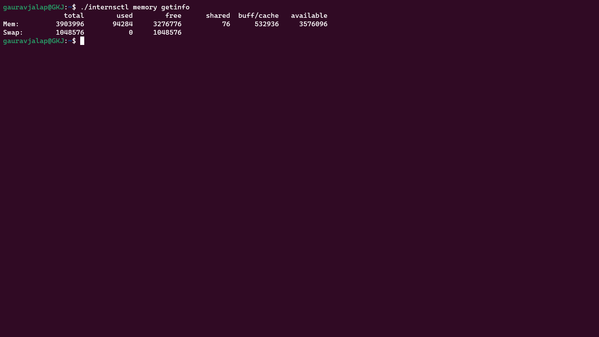
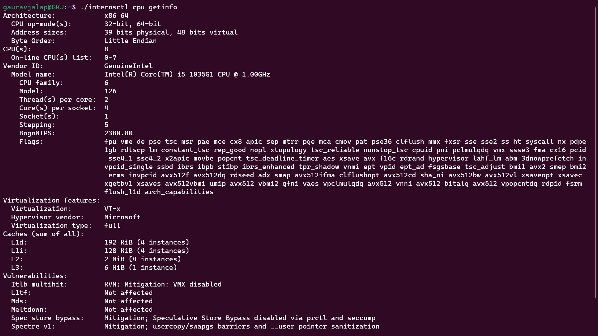
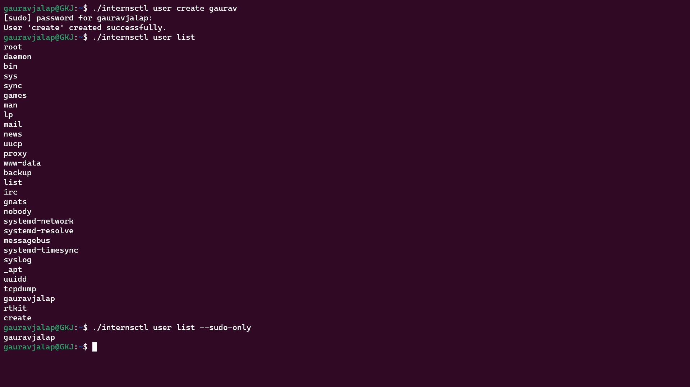
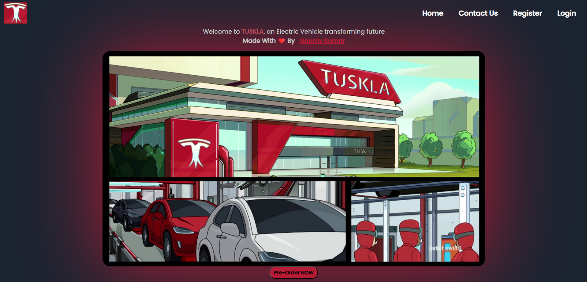
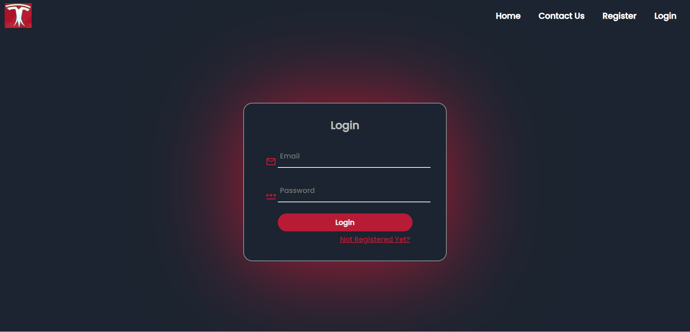
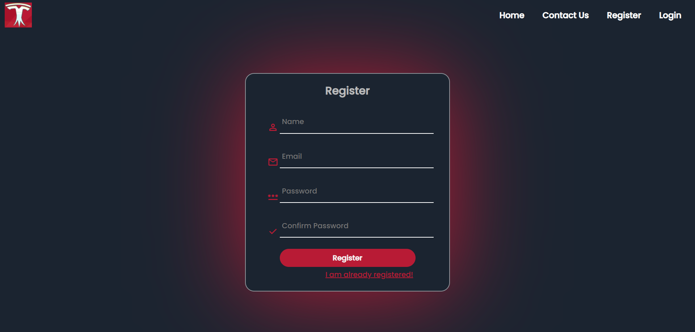
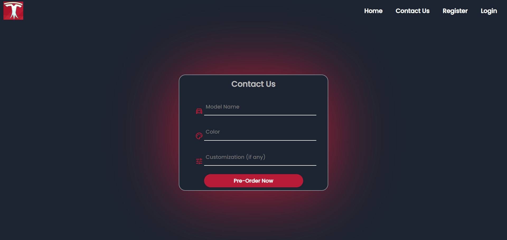

# Round-1 Code is above on folder having name "Round1"
  * Create a Linux command via bash script as per the instructions in Ubuntu
  * Command name - internsctl
  * Command version - v0.1.0
  * Done Both Section A & B
  * Repo Link: https://github.com/gauravjalap/internsctl

**Here are some Screenshots of the commands**

# Round-2 TUSKLA Car Selling Application

Welcome to TUSKLA, a Car Selling Application developed using HTML, CSS, JavaScript, Node.js, Express.js, and MongoDB.

## Table of Contents

- Overview
- Features
- Backend
- Authentication
- Schemas
- Routes

## Overview

TUSKLA is a web-based Car Selling Application that allows users to explore a variety of cars, pre-order them, and manage their account. The application is built using a stack of technologies including HTML, CSS, JavaScript for the frontend, and Node.js, Express.js, and MongoDB for the backend.

## Features

- *Home Page:* Browse through a collection of cars available for sale.
- *Contact Us Page:* Pre-order cars and reach out for inquiries.
- *Login/Register Page:* Securely manage your account by logging in or registering.
- *Backend:* Utilizes Node.js and Express.js for server-side functionality.
- *MongoDB:* Data is stored in a MongoDB database for efficient data management.
- *Authentication:* JWT tokens are used for secure user authentication.

## Backend
The backend of the application is built using Node.js and Express.js. The server is initialized in server.js, and routes are defined in the routes directory.

## Authentication
User authentication is implemented using JWT (JSON Web Tokens). Users can securely log in and access their accounts using token-based authentication.

## Schemas
UserSchema provide skeleton for data storing. User details and corresponding order details are stored in the MongoDB database using the userSchema defined in the models directory.

## Routes
    /login: User login route.
    /register: User registration route.
    /contact: Pre-order cars and contact route.
    /userdata: Get user data route.

**Here are some Screenshots of the Website**

